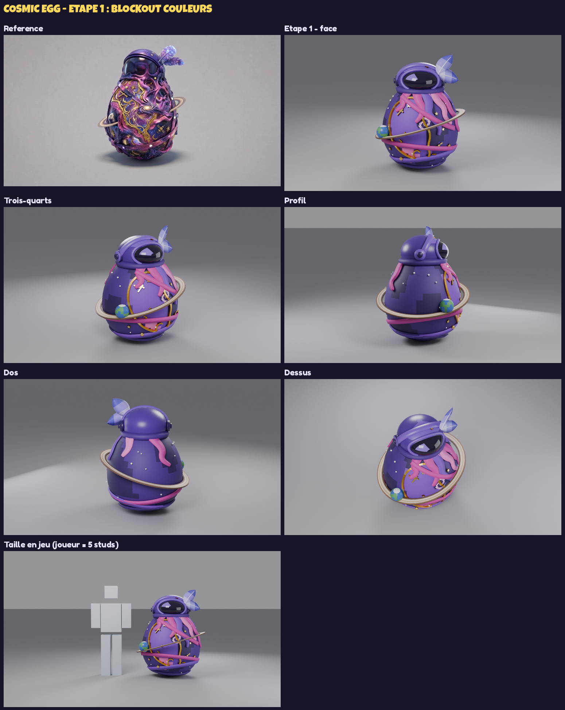

# Cosmic Egg — œuf à collectionner (Brainrot Fighter)

Œuf de gacha / icône de pass, d'après l'image de référence : un œuf galaxie violet coiffé
d'un casque d'astronaute avec visière sombre et deux plumes cosmiques. Autour : un anneau de
Saturne incliné, une petite Terre, un cartouche doré (étoiles, lunes, croix, satellite), une
galaxie en spirale, des drapés de nébuleuse qui coulent sous le casque et des rubans autour
du bas de l'œuf.

## Méthode en deux étapes

| Étape | Contenu | État |
|---|---|---|
| **1 — Blockout couleurs** | volumes purs, couleurs en aplats (texture palette), proportions et accessoires fusionnés | **à valider** |
| 2 — Final | texture galaxie peinte (1024 px), reliefs et filigrane en relief (normal map), métal doré, visière réfléchissante, étoiles lumineuses, `SurfaceAppearance` PBR | après validation |



## Étape 1 en chiffres

| Mesure | Valeur |
|---|---|
| Taille | 3,4 × 3,5 × 4,2 studs (anneau compris), posé sur le sol |
| Triangles | 8 542 au total : **un seul MeshPart**, sous la limite de 10 000 de Roblox |
| Pièces dans Blender | 10 : corps, casque, visière, plumes, anneau, planète, or, galaxie, nébuleuse, étoiles |
| Texture | palette 128 × 128 px (+ cartes de rugosité et de métal pour un `SurfaceAppearance`) |

Le script se vérifie à chaque exécution et affiche `CHECKS passed=9 failed=0`. Il contrôle
notamment :

- la limite de triangles et la hauteur de l'objet ;
- que l'œuf est posé sur le sol et que l'anneau déborde bien de l'œuf ;
- que la visière dépasse du casque ;
- que chaque face est peinte et que les normales pointent vers l'extérieur.

## Tester dans Roblox Studio

1. **Fichier → Importer 3D**, choisis `CosmicEgg_Stage1.fbx` : un seul MeshPart arrive,
   déjà en couleurs.
2. S'il arrive gris, importe `CosmicEgg_Palette.png` dans le Gestionnaire de ressources et
   colle son identifiant dans le `TextureID` du MeshPart.
3. La taille se règle directement dans Studio (outil Échelle). À l'étape 1, l'œuf mesure un
   peu moins qu'un joueur, comme un œuf d'éclosion posé dans le monde.

## Régénérer

Tout est produit par `cosmic_egg.py`. Tout se règle en haut du script :

- `H` et `R` : hauteur et largeur de l'œuf ;
- `HELMET_C` et `HELMET_R` : position et taille du casque ;
- `RING_Z`, `RING_TILT`, `RING_LEAN`, `RING_IN` et `RING_OUT` : l'anneau ;
- `PALETTE` : les couleurs.

```bash
EXPORT_DIR=BrainrotFighter/Items/CosmicEgg RENDER_PREVIEW=1 SAMPLES=40 \
  python BrainrotFighter/Items/CosmicEgg/cosmic_egg.py
```

`DEBUG_BACKFACES=1` colore en rouge toute face vue de dos dans les aperçus.

## Fichiers

| Fichier | Rôle |
|---|---|
| `cosmic_egg.py` | générateur (source unique du modèle) |
| `CosmicEgg_Stage1.fbx` | le modèle de l'étape 1, à importer dans Studio |
| `CosmicEgg_Palette.png`, `_Roughness.png`, `_Metalness.png` | textures (couleur, rugosité, métal) |
| `CosmicEgg_Stage1.blend` | la scène Blender générée (sortie, pas une source) |
| `CosmicEgg_Stage1_Review.png`, `previews/` | aperçus : référence, face, trois-quarts, profil, dos, dessus, taille en jeu |
