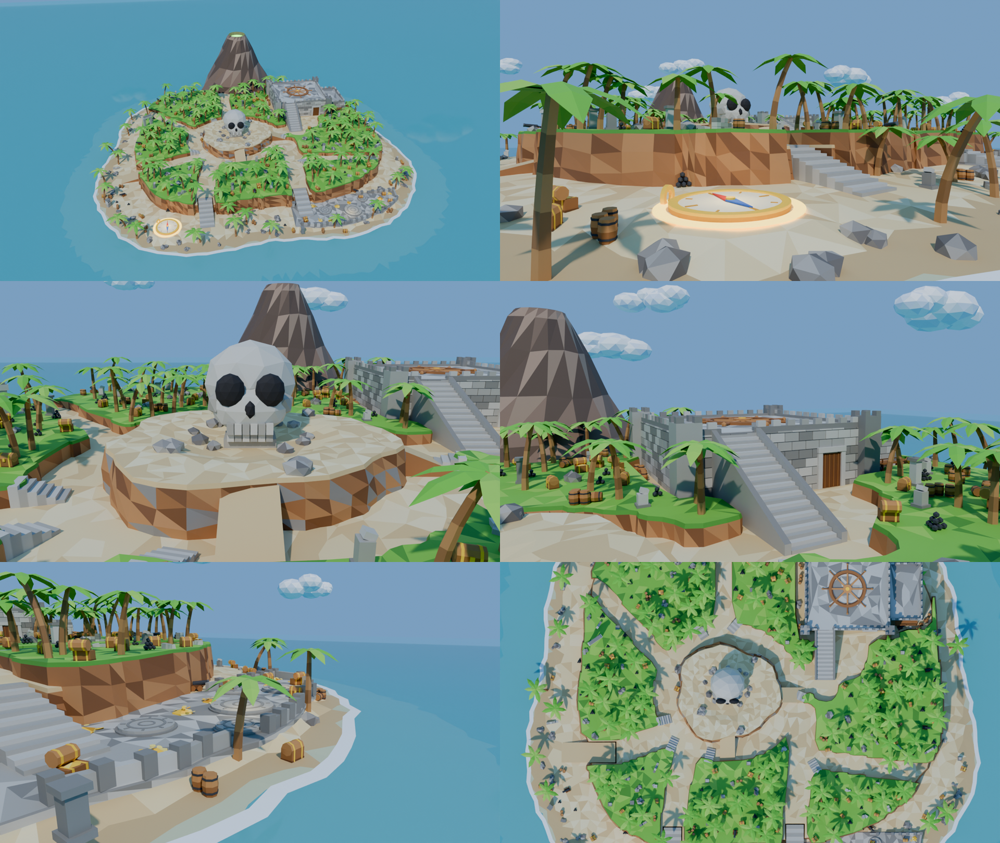

# Île au trésor pirate (PirateIsland)

Map de test autonome du projet **Brainrot Fighter**, générée d'après l'image de référence
d'une île pirate : une seule île en terrasses, dense, posée sur la mer. Elle se teste seule
dans une place Roblox, sans lobby ni générateur.



Le nom `PirateIsland` est provisoire, car la zone n'a pas encore de numéro dans la liste
des zones. Pour la renommer, change `NAME` en haut de `pirate_island.py` et régénère.

## Lecture de la référence

### MAP

- **Type de layout** : île unique en terrasses, entourée de mer, vue isométrique de face.
- **Direction** : plage d'apparition devant (-Y) → plateau central → fort du boss au fond à
  droite (+Y), volcan en arrière-plan.
- **Dimensions** : l'image, lue naïvement, donnerait une île d'environ 600 studs. Elle est
  **compressée de 40 %** comme demandé : environ **350 × 330 studs** au trait de côte, et
  un plateau d'environ 280 × 256.

### ZONES (dans l'ordre de parcours)

| # | Nom | Niveau | Position | Contenu |
|---|---|---|---|---|
| 1 | Plage d'apparition | L1 (z 0,3 → 3,6) | devant à gauche | boussole dorée lumineuse (spawn), tonneaux, boulets, statue de pierre, palmiers |
| 2 | Coffre-fort au trésor | L1 (z 3,9) | devant à droite | dallage gris, murets et piliers, 5 socles ronds gravés, tas d'or, coffres ouverts |
| 3 | Escaliers taillés dans la falaise | L1 → L2 | devant, de part et d'autre du bloc central | marches de pierre entre deux parois de terre |
| 4 | Plateau : chemins de sable | L2 (z 12,2 → 13,8) | toute l'île | chemins qui rayonnent autour du cratère |
| 5 | Blocs d'herbe (palmeraies) | L2+ (z 17 → 19) | entre les chemins | palmiers serrés, coffres, tonneaux, canons, boulets, ruines |
| 6 | Cratère du crâne | relief central (z 21 → 24) | centre | crâne de pierre géant entouré de rochers, deux rampes |
| 7 | Fort (arène du boss) | L3 (z 34) | fond à droite | toit dallé avec la roue de gouvernail géante, créneaux, tourelles, grand escalier, porte en bois, aile crénelée plus basse avec balcon en bois |
| 8 | Volcan | décor | fond | cône brun, cratère vert lumineux, fumée verte |

### OBJETS

| Objet | Où | Forme / couleur | Taille (studs) |
|---|---|---|---|
| Palmier | blocs, plage | tronc courbe brun annelé, 6-7 palmes vertes | 14 à 21 de haut |
| Coffre | partout | bois brun, cerclages et serrure dorés, couvercle bombé, parfois ouvert plein d'or | 4 × 2,6 × 3,6 |
| Tonneau | partout, par 2 à 4 | bois, deux cerclages de fer, parfois couché | Ø 2,6, h 3,4 |
| Canon | bords des blocs, pointé vers la mer | fût noir sur affût de bois à 4 roues | 3,8 × 2,6 × 3 |
| Pile de boulets | blocs, plage | pyramide de sphères noires | 4 à 10 boulets |
| Tas d'or | coffre-fort, coffres | monticule doré et pièces | Ø 5 à 9 |
| Ruines | blocs, plage | piliers, blocs épars, murs cassés, porche de pierre | jusqu'à 15 de haut |
| Crâne | cratère | pierre claire, orbites noires, dents | environ 30 de haut |
| Roue de gouvernail | toit du fort | bois, 8 rayons et 8 poignées | Ø 40 poignées comprises |
| Boussole | plage d'apparition | or, cadran crème, aiguille rouge et bleue, anneau lumineux | Ø 22 |
| Socle rond | coffre-fort | pierre grise, anneaux gravés | Ø 10 à 17 |

### AMBIANCE

- **Éclairage** : plein jour, soleil chaud, ciel bleu avec nuages blancs.
- **Style** : low-poly cartoon, couleurs saturées.
- **Palette** : sable clair, herbe vert vif, falaises brunes, pierre grise, bois brun, or,
  mer turquoise bordée d'écume blanche.

### Points à confirmer

- La **statue grise** de la plage gauche : une petite figure de pierre (totem), À CONFIRMER.
- Les **socles ronds** du coffre-fort : ils servent ici de repère aux téléporteurs, mais
  restent en pierre gravée non lumineuse, comme sur l'image. À CONFIRMER selon leur rôle
  en jeu.
- La **roue de gouvernail** : elle est posée à plat sur le toit du fort, qui sert d'arène
  du boss.

## Comment les consignes sont appliquées

| Consigne | Ce qui est construit |
|---|---|
| Compresser de 40 % | île d'environ 350 × 330 studs ; le cratère central est à 160 studs du spawn, le fort du boss à 280 |
| Une seule île continue | tout part de l'île ou de son fond marin, aucun morceau ne flotte ; le volcan sort de la mer et s'accroche au plateau |
| Sol jamais plat | plage en pente de 3,6 à 0,3 avec de petites dunes, plateau ondulé (12,2 → 13,8), blocs d'herbe bosselés, cratère creusé |
| 3 terrasses | **L1** plage et spawn (z 0 à 4) · **L2** plateau et blocs (z 12 à 19) · **L3** toit du fort, arène du boss (z 34) |
| Falaises, rampes, escaliers | falaises de terre facettées sous le plateau et sous chaque bloc ; 2 escaliers taillés dans la falaise (L1 → L2) ; 1 rampe de sable (plage ouest → L2) ; 2 rampes vers le cratère ; 7 escaliers de pierre pour monter sur les blocs ; grand escalier L2 → L3 |
| Centre jamais vide | cratère surélevé avec le crâne de 30 studs et ses rochers : il coupe les lignes de vue, on le contourne par l'anneau de sable ou on y monte par les rampes |
| Tout remplir | les chemins de sable sont tracés d'abord ; **tout le reste du plateau devient automatiquement un bloc d'herbe**, garni de 120 palmiers et d'environ 400 accessoires de la référence |
| Séparer les zones | les palmeraies séparent naturellement les chemins : spawn, coffre-fort, cratère, parvis du fort, belvédères ouest et est |

Le milieu des chemins reste libre pour se battre contre les mobs : les accessoires se
placent sur leurs bords.

## Installer dans Roblox Studio

1. **Importe** `PirateIsland.fbx` : menu **Fichier → Importer 3D** (ou bouton **Importer 3D**
   de l'onglet Avatar), puis insère-la dans le Workspace.
2. **Installe-la** : ouvre la barre de commande (**Affichage → Barre de commande**). Vérifie
   que tu es en **mode édition** (pas en Play), colle **tout** le contenu de
   `PirateIsland_Test.lua`, puis appuie sur Entrée.
3. **Enregistre la place**, puis lance **Play** : tu apparais sur la boussole dorée.

Le script fait 116 Ko. Si la barre de commande le refuse, passe par le bouton
**Exécuter un script** (*Run Script*) de l'onglet Modèle, s'il existe dans ta version de
Studio : il lance directement le fichier `.lua`.

La Sortie doit afficher :

```
----- Installation de PirateIsland -----
✅ Tout est ancré
✅ Taille : … studs
✅ Orientation détectée
✅ 1402 surfaces de collision créées
✅ Mer créée (eau du terrain Roblox)
✅ 5 lumières
✅ 127 objets vivants
✅ 5 émetteurs de particules
✅ Script d'animation MapLife installé dans StarterPlayerScripts
✅ PirateIsland prête ! Lance Play : tu apparais sur la boussole dorée de la plage.
```

Le script peut être relancé autant de fois que nécessaire. Il crée aussi la **mer** avec
l'eau du terrain Roblox : on peut y nager, et elle a de vraies vagues. Un fond et des murs
invisibles l'entourent à 800 studs. Si d'autres maps de test sont déjà dans la place,
celle-ci se range 2 000 studs plus loin.

Si la map est grise après l'import, importe `PirateIsland_Palette.png` dans le Gestionnaire
de ressources, colle son identifiant (`rbxassetid://…`) dans `TEXTURE_ID` en haut du
script, puis relance-le.

## Une île vivante

Le LocalScript `MapLife` est le même que celui de la zone 6 : chaque installeur le crée à
l'identique. Il anime la map sur l'écran de chaque joueur, sans rien coûter au serveur.

| Quoi | Mouvement |
|---|---|
| 120 couronnes de palmiers | se balancent dans le vent, chacune à son rythme |
| Aiguille de la boussole | tourne lentement |
| Anneau de la boussole, lave du volcan | respirent (pulsation de lumière) |
| Écume du rivage | monte et descend avec les vagues |
| Nuages | dérivent autour de l'île à 3 vitesses |
| Mer | vagues de l'eau du terrain Roblox |

Particules : fumée verte du volcan, paillettes d'or sur la boussole et sur les tas d'or.

## Ce que ça coûte

| Mesure | Valeur |
|---|---|
| MeshParts | 218 (moins de 9 500 triangles chacune) |
| Triangles | 98 585 |
| Surfaces de collision invisibles | 1 402 |
| Lumières | 5 (1 seule avec ombres) |
| Objets animés | 127, déplacés en un seul appel par image (`workspace:BulkMoveTo`) |

Les collisions ne viennent jamais des meshes du sol. Ce sont des bandes invisibles qui
**épousent le relief** : chacune suit la pente dans le sens de la marche et s'incline sur
le côté. Mesuré sur 900 points au hasard, l'écart médian entre ces bandes et le sol visible
est de 0,1 stud (95 % des points à moins de 0,33).

Les accessoires (rochers, palmiers, coffres, fort, crâne) ont une collision précise. Les
objets animés n'en ont pas.

## Régénérer la map

Tout est produit par `pirate_island.py`. **Ne modifie jamais le `.blend` à la main** : il
est écrasé à chaque génération.

- Dans Blender : onglet **Scripting → Nouveau**, colle le script, puis ▶ **Exécuter**.
  Les fichiers sont écrits dans `~/BrainrotFighter/PirateIsland`.
- En ligne de commande (Python 3.11 + module `bpy`) :

  ```bash
  EXPORT_DIR=BrainrotFighter/PirateIsland RENDER_PREVIEW=1 SAMPLES=24 SAVE_BLEND=1 \
    python BrainrotFighter/PirateIsland/pirate_island.py
  ```

  `DEBUG_BACKFACES=1` colore en rouge mat toute face vue de dos dans les aperçus. Ces faces
  seraient invisibles dans Roblox.

Les réglages se trouvent en haut du script :

| Réglage | Effet |
|---|---|
| `Z_*` | hauteurs des niveaux |
| `SHORE`, `PLATEAU_BASE` | contours de l'île |
| `PATHS` | tracé des chemins de sable ; les blocs d'herbe se recalculent tout seuls autour |
| `PALM_MAX` | nombre de palmiers |
| `fill(...)` dans `props()` | densité des accessoires |

## Ce qui a été vérifié, et ce qui reste à tester dans Studio

Le script s'auto-vérifie : `CHECKS passed=32 failed=0`. Il contrôle :

- les repères d'orientation ;
- la limite de triangles ;
- la présence de chaque objet animé et de chaque porteur de lumière ou de particules ;
- la couleur de chaque néon ;
- une surface de collision sous le spawn ;
- **l'accès à pied depuis le spawn**, sans sauter, jusqu'au plateau, au bord et au fond du
  cratère, au toit du fort, au coffre-fort, au haut de la rampe ouest, à la plage du fond et
  aux 7 blocs d'herbe munis d'escaliers ;
- que la plage et le plateau ne sont pas plats ;
- l'absence de faces vues de dos, sur plus de 14 000 rayons ;
- les budgets de collisions, de lumières et de taille de l'installeur.

Vérifié en plus :

- les deux scripts Luau compilent (`luau-compile`) ;
- le contrôle de types avec l'API Roblox (`luau-lsp`) ne signale aucune propriété ni méthode
  inexistante ;
- la chaîne de collisions a été relue par un vrai interpréteur Luau : 1 402 entrées, aucune
  mal formée ;
- `MapLife.client.lua` est identique octet pour octet à celui de la zone 6.

Studio n'était pas disponible ici. **Rien n'a donc encore tourné dans Roblox.** À vérifier
au premier lancement :

1. les lignes ✅ de la Sortie, sans ⚠️ ;
2. en Play :
   - on marche sur la plage ;
   - on monte les escaliers et on fait le tour du crâne ;
   - on monte sur le toit du fort ;
   - les palmiers bougent ;
   - on peut nager dans la mer ;
3. la fluidité sur mobile : émulateur d'appareils de Studio, puis `Ctrl+F6` pour ouvrir le
   MicroProfiler.

## Fichiers

| Fichier | Rôle |
|---|---|
| `pirate_island.py` | générateur (source unique de la map) |
| `PirateIsland.fbx` | la map, à importer dans Studio |
| `PirateIsland_Test.lua` | installeur, à coller dans la barre de commande |
| `MapLife.client.lua` | copie lisible du script d'animation que l'installeur crée |
| `PirateIsland_Palette.png` | texture palette (seulement si la map est grise) |
| `PirateIsland.blend` | la scène Blender générée (sortie, pas une source) |
| `PirateIsland_Previews.png`, `previews/` | aperçus : vue d'ensemble, spawn, cratère, fort, coffre-fort, plan |

Repères d'orientation, communs à toutes les zones :

- `Sol_Arene` est le toit du fort ;
- `Star_Socle` est la boussole ;
- `Neon_arche` regroupe les gravures des socles ronds.

Ne les renomme pas. `Decor_SkullRock` est le marqueur propre à cette map.
