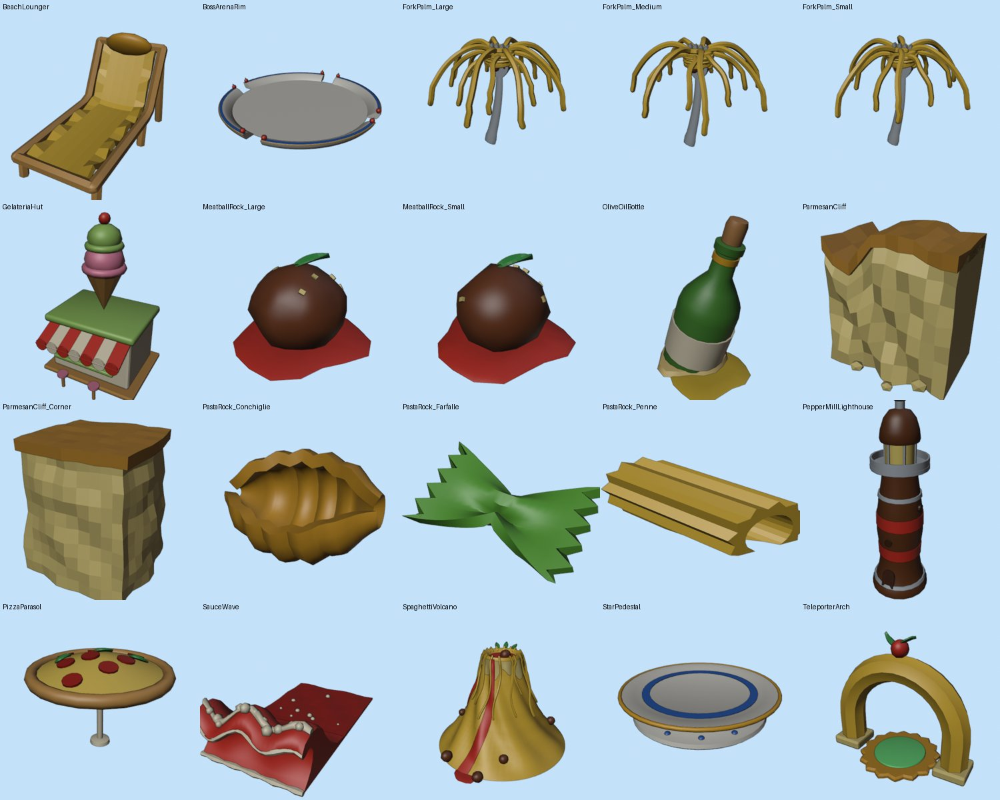
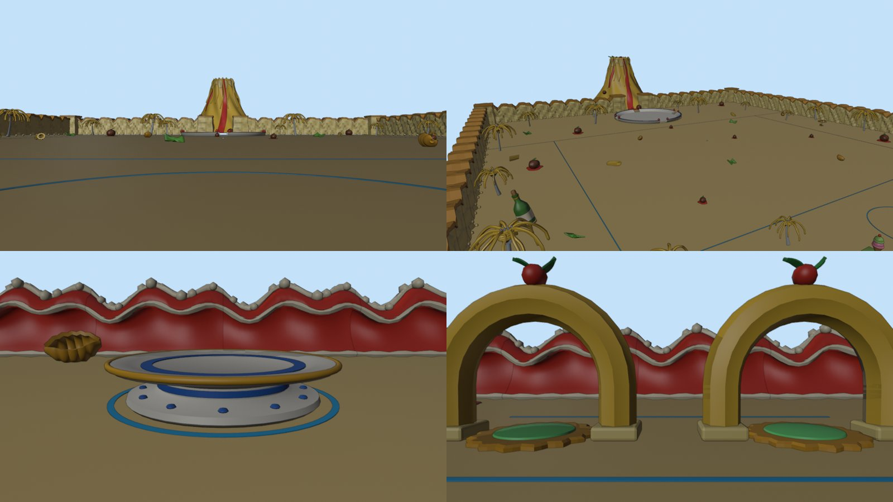

# Brainrot Fighter — Zone 1 : Spaghetti Beach

Kit de décor de la zone de départ, **généré par script** dans Blender
(`blender/z1_spaghetti_beach.py`). Plage italienne absurde : sable doré, mer de
sauce tomate, tout en pâtes et nourriture géante.



## Lancer le script

**Dans Blender (4.x ou 5.x)**
1. Onglet **Scripting** → **Open** → `blender/z1_spaghetti_beach.py`.
2. En haut du script, règle `EXPORT_DIR` (par défaut
   `~/BrainrotFighter/Z1_SpaghettiBeach_FBX`, soit `C:\Users\<toi>\…` sous Windows).
3. **Run Script** (`Alt+P`). Quelques secondes suffisent (2 s mesurées en ligne de commande).
4. Ouvre la console système (*Window → Toggle System Console* sous Windows) :
   elle affiche le tableau des assets et doit finir par
   `CHECKS passed=… failed=0`.

**En ligne de commande**
```bash
"/c/Program Files/Blender Foundation/Blender 5.2/blender.exe" -b --python "BrainrotFighter/blender/z1_spaghetti_beach.py"
```

Le script peut être relancé autant de fois que tu veux : il ne supprime et ne
reconstruit que ce qu'il a créé (collections `Z1_*`, matières `Z1_*`). Le reste
de ton fichier `.blend` n'est pas touché.

## Ce qu'il produit

| Collection | Contenu |
|---|---|
| `Z1_Assets` | Un exemplaire de chaque asset, aligné en rangée au nord de la zone (y = 760). |
| `Z1_Layout` | 140 copies liées placées selon le plan, pour prévisualiser la zone. |
| `Z1_Layout/Z1_Preview` | Aides d'aperçu, **jamais exportées** : sol de sable 800 × 800, mer de sauce, repères au sol (cercle de spawn Ø80, cercle de l'arène, limites de la zone de combat, bande des arches). |
| `EXPORT_DIR` | Un `.fbx` par asset de `Z1_Assets` (20 fichiers, ~2 Mo). |

Règles tenues par chaque asset :
- préfixe `Z1_`, origine au centre de la base (z = 0), rotation 0, échelle 1 ;
- une couleur unie par mesh. Un asset multicolore est un **Empty** au nom de
  l'asset, avec un enfant par couleur nommé `<asset>__<Couleur>`
  (ex. `Z1_GelateriaHut__Tomato`) ;
- aucune texture, aucun texte, aucune marque ;
- face avant = **-Y** (ce que montre la vue *Front* de Blender).

Deux exceptions à « centré sur la base » : les **palmiers** et la **bouteille**
ont leur origine au pied du tronc et au point où la bouteille entre dans le sable
(ils penchent : le centre de leur emprise tomberait dans le vide). Le **volcan**
a la sienne sur son axe.

## Les assets

| Asset | Sous-objets | Tris max / mesh | Taille X × Y × Z (studs) |
|---|---:|---:|---|
| `Z1_ForkPalm_Small` / `_Medium` / `_Large` | 3 | 4 284 / 4 764 / 5 244 | hauteur 24,7 / 34,2 / 45,5 |
| `Z1_PastaRock_Penne` | 1 | 580 | 21,8 × 7,4 × 7,5 |
| `Z1_PastaRock_Farfalle` | 1 | 840 | 17,2 × 9,0 × 7,4 |
| `Z1_PastaRock_Conchiglie` | 1 | 1 514 | 13,8 × 9,2 × 8,2 |
| `Z1_PizzaParasol` | 5 | 622 | 18,6 × 18,6 × 12,9 |
| `Z1_BeachLounger` (transat) | 3 | 708 | 4,5 × 9,1 × 5,7 |
| `Z1_MeatballRock_Small` / `_Large` | 4 | 176 / 338 | Ø 11 × 6,8 / Ø 23 × 14,1 |
| `Z1_ParmesanCliff` (module) | 2 | 612 | **40** × 32,7 × 44,5 |
| `Z1_ParmesanCliff_Corner` | 2 | 1 200 | 44,8 × 45,0 × 47,9 |
| `Z1_PepperMillLighthouse` | 5 | 992 | 19,2 × 19,2 × 63,4 |
| `Z1_OliveOilBottle` | 6 | 358 | 23,6 × 21,4 × 34,6 |
| `Z1_GelateriaHut` | 6 | 552 | 19,0 × 18,1 × 29,8 |
| `Z1_SauceWave` (module) | 3 | 1 340 | **40** × 75,5 × 23,6 |
| `Z1_StarPedestal` | 3 | 1 216 | **Ø 30** × 5,4 |
| `Z1_TeleporterArch` (pad Ø 16 inclus) | 6 | 668 | 28,0 × 16,0 × 24,1 |
| `Z1_BossArenaRim` (4 ouvertures de 18) | 5 | 2 080 | **Ø 180** × 12,6 |
| `Z1_SpaghettiVolcano` | 5 | 9 168 | 210 × 225 × 160,5 |

Maximum mesuré : 9 168 triangles (volcan). Un groupe de couleur qui dépasserait
9 500 serait coupé automatiquement en `__Couleur` + `__Couleur_2`.

**Modules de bordure.** `Z1_ParmesanCliff` et `Z1_SauceWave` font exactement 40
de large et leurs deux bouts sont identiques : aligne-les tous les 40 studs, ils
se raccordent sans couture. `Z1_ParmesanCliff_Corner` ferme les angles et coiffe
les bouts de falaise.

## Le plan (Z1_Layout)



- **Entrée (-Y)** : spawn en (0, -340), rayon 40 laissé libre ; socle de la Star
  en (-200, -340) ; deux arches en x = 132 et 168 (dans la bande 120–180) ; plage
  avec gelateria, 3 groupes parasol + transats, phare-moulin à poivre en
  (330, -362).
- **Zone de combat** (y = -270 → +140) : au milieu (|x| < 260), seulement des
  pâtes et boulettes basses (≤ 9 de haut), espacées d'au moins 45 ; palmiers,
  bouteille, grosses boulettes sur les côtés.
- **Arène du boss** : anneau Ø180 en (0, 270), ouvertures vers ±X et ±Y.
- **Volcan** : axe en (0, 480), coulée principale tournée vers l'arène. Il
  remplace les deux modules de falaise du milieu du bord nord ; deux blocs
  d'angle encadrent la brèche.
- **Bordures** : vagues de sauce au sud (front à y = -386), falaises de parmesan
  à l'ouest, au nord et à l'est.

Le script vérifie ces règles à chaque exécution (spawn libre, Star et arches
dégagées, arène vide, hauteur et espacement du milieu, Ø30 du socle, Ø180 de
l'arène, modules de 40).

## Import dans Roblox Studio

Réglages d'export appliqués par le script (doc Roblox *Blender export
settings*) : `Apply Scalings = FBX Unit Scale`, `Forward = Z`, `Up = Y`, aucun
autre facteur d'échelle, triangulé, sans armature ni animation.

1. Onglet **Home** (ou **Avatar**) → **Import 3D**, choisis un `.fbx`.
2. **File Transform** : *World Forward* = **Front**, *World Up* = **Top**.
3. **File Geometry** : *Scale Unit* = **Stud**.
4. Premier contrôle : `Z1_StarPedestal` doit mesurer **30 studs** de large.
   Si ce n'est pas le cas, ne touche pas au script : corrige *Scale Unit*.

### Couleurs et matières

Chaque mesh a une seule matière `Z1_<Couleur>`. Si Studio n'applique pas la
couleur, règle `Color` de chaque MeshPart d'après son suffixe `__<Couleur>` :

| Couleur | Hex | | Couleur | Hex |
|---|---|---|---|---|
| Pasta | `#F6C945` | | Silver | `#C9D1D9` |
| PastaDark | `#E3A631` | | Porcelain | `#FAF6EC` |
| Spinach | `#6DBE45` | | Majolica | `#2F6FD0` |
| Cheese | `#FFDD66` | | Gold | `#F2B632` |
| Tomato | `#E23B2E` | | Wood | `#6E3F22` |
| SauceDeep | `#B8261C` | | Breadstick | `#D9A35B` |
| Basil | `#3FA34D` | | Glass | `#4F8F3A` |
| Cream | `#FFF3D6` | | Oil | `#E8C43A` |
| Parmesan | `#F4DE8E` | | Cork | `#C08A55` |
| Rind | `#D69A3C` | | Light | `#FFE680` |
| Meatball | `#7B4428` | | Glow | `#7CF08C` |
| Pistachio | `#A6D46E` | | Strawberry | `#F592B0` |
| Waffle | `#D29B52` | | Dark | `#4A2A1A` |
| Sand | `#F3D58E` | | | |

Conseils : passe `__Light` (lanterne du phare) et `__Glow` (pad des arches) en
matière **Neon**. Mets `CanCollide = false` sur les décors fins (spaghettis des
palmiers, feuilles de basilic, écume) et gère les bordures avec des murs
invisibles : les falaises et les vagues sont une barrière *visuelle*.

## Ce qui a été vérifié, et ce qui ne l'a pas été

- Exécuté sans erreur sous **Blender 4.2.0 et 5.0.1** (même résultat au stud
  près), relancé deux fois de suite sans doublon.
- Tous les meshes sont fermés, normales vers l'extérieur.
- Les 20 FBX ont été réimportés dans Blender : mêmes dimensions, une racine au
  nom de l'asset, base à z = 0, une matière par mesh, ≤ 10 000 triangles.
- **Pas encore testé dans Roblox Studio** (couleurs importées, échelle réelle) :
  c'est le point 4 de l'import ci-dessus.

Le script accède aux nœuds par **type** et aux sockets par **identifier**, donc
il marche aussi sur un Blender en français.
