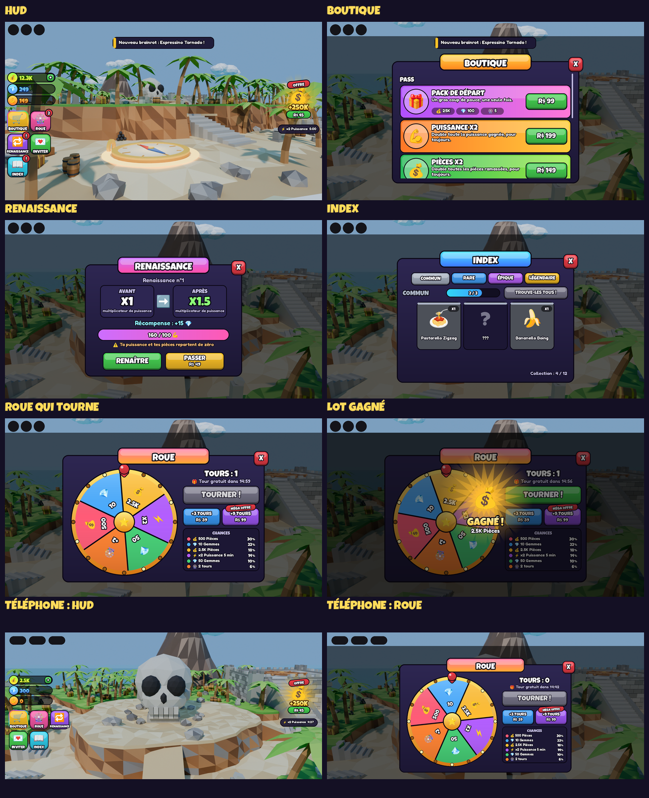

# BrainrotUI — l'interface de Brainrot Fighter

Une interface complète **qui fonctionne vraiment**, reprise de la disposition de l'exemple
envoyé (*Essential UI Pack* de Swarve Studios). Elle est entièrement réécrite : aucune
image, aucun son et aucune ligne de code du pack n'est réutilisé. Tout est dessiné en
code (cadres, contours, dégradés, emojis), il n'y a donc **aucune image à importer**.



*Aperçus rendus hors de Roblox par le simulateur de `tools/` : la mise en page et les
couleurs sont fidèles, le rendu exact des polices peut légèrement différer dans Studio.*

## Ce qu'il y a dedans

| Élément | Ce qu'il fait |
|---|---|
| **HUD** | Pièces, gemmes et puissance avec compteurs animés et « +N » qui s'envolent. Boutons BOUTIQUE (contour arc-en-ciel animé), ROUE, RENAISSANCE, INVITER et INDEX, avec pastilles rouges : tours disponibles, renaissance possible, nouvel objet trouvé. |
| **Offre du moment** | À droite, avec rayons qui tournent et prix en Robux. En dessous, les boosts actifs avec leur compte à rebours. |
| **Boutique** | 3 pass (pack de départ, puissance x2, pièces x2), 3 boosts, 3 packs de pièces. Les prix réels sont lus sur Roblox. Un pass déjà acheté affiche POSSÉDÉ. |
| **Renaissance** | Barre de progression, multiplicateur avant et après, récompense, bouton RENAÎTRE (vérifié par le serveur) et PASSER en Robux. |
| **Index** | 12 brainrots en 4 raretés, cachés derrière « ? » tant qu'on ne les a pas trouvés. Compteurs, étiquette NOUVEAU, et gemmes à réclamer quand une série est complète. |
| **Roue** | Dessinée sans image : 6 secteurs, lampes qui clignotent, aiguille qui tressaute à chaque secteur. Un tour gratuit toutes les 15 min et des tours en Robux. Les **chances sont affichées**. |
| **Notifications** | Messages en haut de l'écran, grande fenêtre de gain, écran d'attente pendant un achat. |
| **Objets de test** | Pièces et orbes de puissance qui flottent autour du point d'apparition. Chaque orbe fait découvrir un brainrot de sa rareté. |

Tout marche sur PC, mobile et console : l'interface se redimensionne selon l'écran et passe
sur 3 colonnes sur téléphone pour laisser la place au joystick. Une manette ferme les
fenêtres avec B.

## Ce qui était cassé dans le pack d'origine, et qui est corrigé ici

| Problème du pack | Ici |
|---|---|
| Le bouton **Rebirth ne faisait rien** : aucun script serveur n'écoutait `RebirthRequest`. | La renaissance marche et le serveur vérifie la puissance. |
| **4 scripts** définissaient `ProcessReceipt`. Roblox n'en garde qu'un, donc une partie des achats n'étaient jamais donnés. | Un seul `ProcessReceipt`. Chaque achat est enregistré avant d'être confirmé et n'est jamais donné deux fois. |
| Les tours de roue achetés étaient donnés quand **le client disait « j'ai payé »** (`WheelPurchaseConfirm`) : tours gratuits pour n'importe quel tricheur. | Seul le reçu de Roblox donne quoi que ce soit. |
| L'aiguille de la roue ne s'arrêtait **pas sur le bon secteur**. | La roue s'arrête exactement sur le lot tiré par le serveur (vérifié par test). |
| **9 DataStores**, et 9 `SetAsync` à chaque changement de valeur : limite de requêtes vite atteinte, risque de perte de données. | Une clé par joueur, `UpdateAsync`, sauvegarde automatique, à la déconnexion et à l'arrêt du serveur, nouvelles tentatives en cas d'échec. Un verrou empêche deux serveurs d'écrire le même profil. |
| Roue payante **sans affichage des chances**. | Chances affichées, comme Roblox l'exige pour les lots aléatoires payants. Les tours payants sont masqués dans les pays qui les interdisent (`PolicyService`). |

## Installer dans Roblox Studio

1. Ouvre ta place (par exemple celle de la zone 6 ou de l'île pirate) en **mode édition**.
2. Ouvre la barre de commande (**Affichage → Barre de commande**), colle **tout** le contenu de
   `BrainrotUI_Install.lua`, puis appuie sur Entrée.
3. **Enregistre la place**, puis lance **Play**.

La Sortie doit afficher :

```
----- Installation de BrainrotUI -----
✅ UIConfig installée dans ReplicatedStorage.BrainrotUI
✅ Script serveur installé : ServerScriptService.BrainrotUIServer (4 modules)
✅ Interface installée : StarterPlayerScripts.BrainrotUIClient (13 modules)
✅ BrainrotUI prête ! Enregistre la place, puis lance Play.
```

L'installeur peut être relancé sans risque : il remplace les scripts et **garde ta config**,
y compris tes IDs de produits. Pour repartir de la config d'origine, mets
`OVERWRITE_CONFIG = true` en haut du fichier.

Si le pack d'origine est dans la même place, l'installeur le signale. Désactive alors
`StarterGui.GUI` et ses scripts serveur (`PurchaseHandler`, `ReceiptHandler`, `leaderstats`,
etc.), sinon deux interfaces et deux `ProcessReceipt` tournent en même temps.

**Sauvegarde pendant les tests** : dans *Paramètres du jeu → Sécurité*, active *Autoriser
l'accès de Studio aux services d'API* (la place doit être publiée). Sans ça, tout marche
quand même, mais la progression repart de zéro à chaque Play, et un message le rappelle
en jeu.

## Régler

Tout se règle dans **`ReplicatedStorage.BrainrotUI.UIConfig`**, directement dans Studio :

| Section | Contenu |
|---|---|
| `StartingData` | ce que reçoit un nouveau joueur |
| `Currencies`, `Leaderstats` | compteurs du HUD, colonnes du classement |
| `Rebirth` | coût (`BasePower × Growth ^ n`), bonus par renaissance, gemmes, remise à zéro des pièces |
| `Boosts` | multiplicateurs temporaires |
| `Rarities`, `Index` | raretés (couleur, chance, puissance, récompense de série) et brainrots (nom, emoji) |
| `Wheel` | lots, poids (les chances affichées en découlent), délai du tour gratuit |
| `GamePasses`, `Products` | produits Robux : **mets tes IDs ici** |
| `Pickups` | objets de test (nombre, rayon, réapparition) ; `AutoSpawn = false` pour les retirer |
| `Sounds`, `Theme`, `Text` | sons, couleurs et polices, tous les textes affichés |

**Mettre en vente** : sur le Creator Dashboard, crée les *game passes* et les *developer
products* (Monétisation), puis copie chaque ID dans le champ `Id` correspondant. Tant qu'un
ID vaut 0, le bouton affiche le prix indicatif `PriceHint` et prévient le joueur que
l'article n'est pas encore en vente. Dès qu'un ID est renseigné, le vrai prix s'affiche.

## Brancher ton jeu dessus

Le serveur expose ses règles à tes propres scripts :

```lua
local Economy = require(game.ServerScriptService.BrainrotUIServer.Economy)

Economy.Earn(player, "Power", 10)          -- gain de jeu : renaissances, pass et boosts appliqués
Economy.Earn(player, "Coins", 50)
Economy.Add(player, { Gems = 5 })          -- don brut, sans multiplicateur
Economy.Discover(player, "Pizzarotto")     -- ajoute un brainrot à l'Index
Economy.Notify(player, "Boss vaincu !", "success")
```

Un mob qui meurt peut appeler `Economy.Earn`. Le HUD, les pastilles et l'Index suivent
tout seuls, et la sauvegarde aussi.

Pour tes propres objets à ramasser, ajoute le tag `BrainrotUIPickup` à une pièce, plus
l'attribut `Kind` (`Coins` ou `Power`) et, pour un orbe, `Rarity`.

## Ce qui a été vérifié, et ce qui reste à tester dans Studio

Vérifié ici :

- tous les scripts compilent (`luau-compile`), y compris l'installeur ;
- le contrôle de types avec les définitions de l'API Roblox (`luau-lsp`) ne signale rien ;
- **le vrai code, serveur et client ensemble, tourne dans un simulateur de l'API Roblox**
  (`tools/`). Chaque propriété, chaque énumération et chaque méthode utilisée y est vérifiée
  contre les définitions officielles.
- une partie scriptée y passe **55 contrôles sur 55**, sans aucune erreur de script :
  - formats des nombres ;
  - tirage pondéré conforme aux chances affichées ;
  - achat accordé une seule fois même si Roblox renvoie le reçu deux fois, puis sauvegardé ;
  - produit inconnu refusé ;
  - renaissance refusée sans assez de puissance ;
  - roue : le tour gratuit passe en premier, tours épuisés refusés ;
  - série de l'Index réclamable une seule fois ;
  - sauvegarde et verrou libérés à l'arrêt ;
  - profil verrouillé par un autre serveur jamais écrasé ;
- la roue peint la bonne couleur sous chaque angle : 300 positions × 720 directions, zéro erreur ;
- l'installeur, lancé deux fois, ne crée aucun doublon et garde la config modifiée ;
- les aperçus ci-dessus sont rendus à partir de l'interface réellement construite par le code.

Studio n'était pas disponible ici. **Rien n'a donc encore tourné dans Roblox.** À vérifier
au premier Play :

1. les lignes ✅ de l'installeur, sans ⚠️ ;
2. les objets de test autour du point d'apparition, puis le compteur qui monte et
   « Nouveau brainrot » à la première orbe ;
3. l'ouverture et la fermeture de chaque fenêtre, et un tour de roue ;
4. les sons : ceux par défaut sont des fichiers intégrés à Roblox (`rbxasset://sounds/…`).
   S'il en manque un, la Sortie l'indique ; remplace-le dans `UIConfig.Sounds`, ou mets `""` ;
5. sur mobile, avec l'émulateur d'appareils de Studio.

## Fichiers

| Fichier | Rôle |
|---|---|
| `BrainrotUI_Install.lua` | **l'installeur à coller dans la barre de commande** (généré) |
| `src/ReplicatedStorage/BrainrotUI/` | `UIConfig` (réglages), `Rules` (formules communes), `Format` (nombres) |
| `src/ServerScriptService/BrainrotUIServer/` | démarrage et requêtes (`init.server.lua`), `PlayerData` (sauvegarde), `Economy` (règles), `Store` (Robux), `Pickups` (objets) |
| `src/StarterPlayerScripts/BrainrotUIClient/` | construction de l'interface (`init.client.lua`), `Widgets` (style), `Hud`, les 4 fenêtres, `Wheel`, `Notify`, `Effects`, `Purchases`, `State`, `PickupFx` |
| `build_installer.py` | régénère l'installeur à partir de `src/` |
| `tools/` | simulateur de l'API Roblox, partie scriptée avec ses contrôles, rendu des aperçus |
| `BrainrotUI_Previews.png`, `previews/` | aperçus |

Pour modifier le code, change `src/`, puis relance :

```bash
python BrainrotFighter/UI/build_installer.py
LUAU=/chemin/vers/luau python BrainrotFighter/UI/tools/run_checks.py --definitions globalTypes.d.luau --render
```

`run_checks.py` a besoin du CLI `luau` et des définitions Roblox de `luau-lsp`. L'option
`--render` demande en plus Pillow, numpy et les polices Fredoka One et Luckiest Guy
(Google Fonts) dans `tools/.cache/fonts/`.
