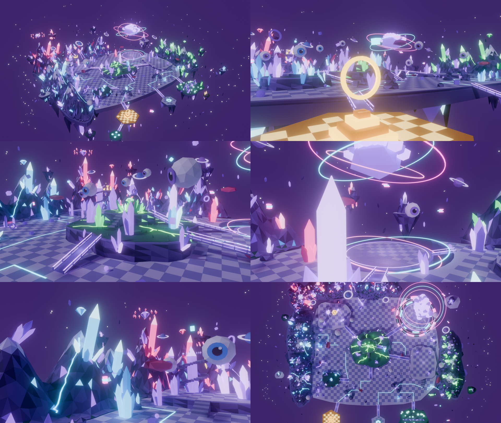

# Zone 6 — Void Brainrot (v2 : terraformée et vivante)

Map de test autonome du projet **Brainrot Fighter** : environ 600 × 600 studs jouables,
sur plusieurs niveaux, sans lobby ni générateur. Elle se teste seule dans une place
Roblox pour y ajouter les mobs.



## Ce qui change par rapport à la v1

**Terraforming.** La map est désormais encadrée par du relief au lieu de s'arrêter net
sur le vide :

- **4 massifs de gemmes** ferment la gauche, le fond et la droite : Améthyste et diamant
  à gauche, le **Pic d'améthyste** (135 studs) dans le coin arrière gauche, un massif rubis,
  améthyste et diamant au fond, émeraude à droite. Ce sont des montagnes low-poly
  facettées, avec des sommets givrés, des facettes de gemme incrustées dans la roche,
  des veines lumineuses qui descendent les pentes et des flèches de cristal géantes.
  On ne peut pas les traverser (collision précise).
- **Falaises facettées** sous chaque niveau surélevé, à la place des murs droits de la v1.
- **Colline à deux étages** : la colline aux veines vertes est couronnée d'un sommet
  (z = 30), accessible par une rampe et un escalier, avec le **Cœur d'émeraude** qui flotte
  au-dessus.
- **Butte aux gemmes** (z = 12) sur la gauche du champ de bataille, avec une géode de
  diamant ouverte, accessible par une rampe.
- **Tour de cristal et belvédère** : l'escalier en spirale « vers nulle part » de la v1
  tourne maintenant autour d'une tour de cristal et mène à un belvédère flottant,
  surmonté d'une topaze.
- **Deux arches de rochers** au-dessus des chemins, **trois failles de gemmes** au sol et
  des rochers au pied des massifs.

Le champ de bataille central reste dégagé pour les combats contre les mobs.

**Gemmes.** Cinq familles, toutes dans la palette violette de la map : améthyste, diamant
(cyan), rubis (rose), émeraude (vert des veines) et topaze (or de l'entrée). On les trouve
sous forme de grappes, de flèches géantes, de gemmes taillées qui flottent au-dessus des
pics, et de gemmes suspendues sous les îles.

**Une map vivante.** Un LocalScript `MapLife`, installé automatiquement, anime **101 objets**
sur l'écran de chaque joueur :

| Quoi | Mouvement |
|---|---|
| 8 yeux flottants | **suivent le joueur du regard** et flottent |
| 10 îles-montagnes autour de la map | dérivent lentement de haut en bas et tanguent |
| 6 grandes gemmes taillées | tournent sur elles-mêmes, flottent, leur lumière respire |
| Trou noir | disque d'accrétion en arcs qui tournent en sens opposés, éclats en orbite, particules qui montent |
| Cerveau cosmique | flotte, ses 3 anneaux tournent comme un gyroscope |
| Anneau doré de la Star | tourne comme une pièce |
| Planètes, anneaux, cubes, bouches | tournent et flottent |
| 8 glitchs | sautillent et clignotent |
| 3 anneaux d'éclats autour de la zone | orbitent à 3 vitesses différentes |
| Étoiles | scintillent en 3 groupes décalés |
| Néons (veines, failles, circuits, champignons, fontaines, ponts) | respirent (pulsation de couleur) |

S'y ajoutent **14 émetteurs de particules** : poussière de vide sur le champ de bataille,
étincelles vertes sur la colline, éclats dans les arches, paillettes d'or sur la Star, et
scintillements autour des gemmes et de la géode.

**Correction d'un bug de la v1.** Les surfaces de collision ne faisaient que 4 studs
d'épaisseur : depuis le plateau, on pouvait entrer dans la colline (sommet à 16 studs) et
marcher dedans. Chaque niveau surélevé est maintenant un bloc plein, du niveau inférieur
jusqu'à son sommet.

## Installer dans Roblox Studio

0. **Supprime l'ancienne map** `Zone6_VoidBrainrot` du Workspace si elle y est encore.
   Sinon, la nouvelle se range à 1 500 studs sur le côté et les deux portent le même nom.
1. **Importe** `Zone6_VoidBrainrot.fbx` : menu **Fichier → Importer 3D** (ou bouton
   **Importer 3D** de l'onglet Avatar), puis insère-la dans le Workspace.
2. **Installe-la** : ouvre la barre de commande (**Affichage → Barre de commande**). Vérifie
   que tu es en **mode édition** (pas en Play), colle **tout** le contenu de
   `Zone6_VoidBrainrot_Test.lua`, puis appuie sur Entrée.
3. **Enregistre la place**, puis lance **Play** : tu apparais sur l'île dorée de l'entrée.

La Sortie doit afficher :

```
----- Installation de Zone6_VoidBrainrot -----
✅ Tout est ancré
✅ Taille : … studs
✅ Orientation détectée
✅ 285 surfaces de collision créées
✅ 96 lumières
✅ 101 objets vivants
✅ 14 émetteurs de particules
✅ Script d'animation MapLife installé dans StarterPlayerScripts
✅ Zone6_VoidBrainrot prête ! Lance Play : tu apparais sur l'île dorée de l'entrée.
```

Le script d'installation peut être relancé autant de fois que nécessaire : il reconstruit
proprement ce qu'il a créé. Les animations ne tournent **qu'en Play**, car elles sont
jouées côté client ; en mode édition, la map reste immobile.

Si la map est grise après l'import, importe `Zone6_VoidBrainrot_Palette.png` dans le
Gestionnaire de ressources, colle son identifiant (`rbxassetid://…`) dans `TEXTURE_ID` en
haut du script, puis relance-le.

## Ce que ça coûte

| Mesure | Valeur |
|---|---|
| MeshParts | 161 (3 916 triangles au maximum par pièce, la limite est 10 000) |
| Triangles | 89 166 au total |
| Surfaces de collision invisibles | 285 |
| Lumières | 96 (5 seulement avec ombres) |
| Particules | 14 émetteurs, environ 90 particules par seconde en tout |

Les animations ne coûtent rien au serveur et ne passent pas par le réseau. Chaque client
déplace 86 pièces par image en un seul appel (`workspace:BulkMoveTo`), rafraîchit
couleurs et lumières 20 fois par seconde, et ignore tout ce qui est à plus de 900 studs de
la caméra. Les pièces qui bougent n'ont ni collision ni requête physique.

## Régler

- **Taille** : `SCALE` en haut de `Zone6_VoidBrainrot_Test.lua` (1 = taille prévue).
- **Figer la map** : supprime le LocalScript `MapLife` de `StarterPlayer → StarterPlayerScripts`.
- **Relief, gemmes et animations** : dans `zone6_void_brainrot.py`, la liste `MASSIFS`
  (pics : x, y, hauteur, rayon), `Massif.decorate` (nombre de grappes, flèches et veines)
  et chaque appel à `alive(...)`, qui porte l'amplitude, la période, la vitesse de rotation
  et la pulsation d'un objet. Régénère ensuite la map.

## Régénérer la map

Tout est produit par `zone6_void_brainrot.py`. **Ne modifie jamais le `.blend` à la main** :
il est écrasé à chaque génération.

- Dans Blender : onglet **Scripting → Nouveau**, colle le script, puis ▶ **Exécuter**.
  Les fichiers sont écrits dans `~/BrainrotFighter/Zone6_VoidBrainrot`.
- En ligne de commande (Python 3.11 + module `bpy`) :

  ```bash
  EXPORT_DIR=BrainrotFighter/Zone6_VoidBrainrot RENDER_PREVIEW=1 SAMPLES=24 SAVE_BLEND=1 \
    python BrainrotFighter/Zone6_VoidBrainrot/zone6_void_brainrot.py
  ```

  `DEBUG_BACKFACES=1` colore en rouge mat toute face vue de dos dans les aperçus. Ces faces
  seraient invisibles dans Roblox.

Le script s'auto-vérifie à chaque exécution et affiche `CHECKS passed=15 failed=0`. Il
contrôle notamment :

- la limite de triangles ;
- les repères d'orientation ;
- l'existence de chaque objet animé, de chaque porteur de lumière et de chaque porteur de
  particules ;
- la couleur de chaque néon ;
- une surface de collision sous le point d'apparition ;
- le relief tourné vers le haut ;
- l'absence de faces vues de dos, vérifiée en lançant plus de 20 000 rayons d'en haut et
  des quatre côtés.

## Ce qui a été vérifié, et ce qui reste à tester dans Studio

Vérifié ici :

- génération : 15 contrôles sur 15 ;
- les deux scripts Luau compilent (`luau-compile`) ;
- le contrôle de types avec les définitions de l'API Roblox (`luau-lsp`) ne signale aucune
  propriété ni méthode inexistante ;
- les aperçus ont été rendus et relus.

Studio n'était pas disponible ici. **Rien n'a donc encore tourné dans Roblox.** À vérifier
au premier lancement :

1. les lignes ✅ de la Sortie ci-dessus, sans ⚠️ ;
2. en Play, les yeux qui te suivent, les îles qui dérivent et le trou noir qui tourne ;
3. la fluidité sur mobile (émulateur d'appareils de Studio, puis `Ctrl+F6` pour le
   MicroProfiler).

## Fichiers

| Fichier | Rôle |
|---|---|
| `zone6_void_brainrot.py` | générateur (source unique de la map) |
| `Zone6_VoidBrainrot.fbx` | la map, à importer dans Studio |
| `Zone6_VoidBrainrot_Test.lua` | installeur, à coller dans la barre de commande |
| `MapLife.client.lua` | copie lisible du script d'animation que l'installeur crée |
| `Zone6_VoidBrainrot_Palette.png` | texture palette (seulement si la map est grise) |
| `Zone6_VoidBrainrot.blend` | la scène Blender générée (sortie, pas une source) |
| `Zone6_VoidBrainrot_Previews.png`, `previews/` | aperçus : vue d'ensemble, entrée, colline, boss, montagnes, plan |

Les noms `Sol_Arene`, `Star_Socle` et `Neon_arche` sont les repères d'orientation communs
à toutes les zones : l'installeur s'en sert pour recaler la map si l'import la tourne ou
la retourne. Ne les renomme pas. `Decor_Sky_Brain` est le marqueur propre à cette v2.
