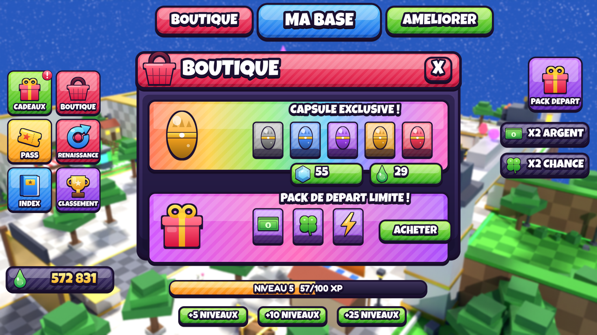

# 🎨 Assets UI — Kaiju Heist

Pack d'images 2D pour l'interface, dans le style « simulateur » des jeux de
référence : contour sombre épais, dégradé vertical, reflet brillant en haut,
rayures diagonales, ombre portée, gros texte cartoon.



`preview_hud.png` est une **maquette** assemblée avec ces fichiers, par-dessus un
rendu du lobby. Elle montre comment les pièces s'emboîtent, ce n'est pas un
asset à importer.

## Ce qu'il y a dedans

Toutes les images sont en PNG à fond transparent, de 1 024 px au maximum (la
limite d'import de Roblox).

| Dossier | Contenu |
|---|---|
| `buttons/` | barre du haut (`nav_boutique`, `nav_ma_base`, `nav_ameliorations`) ; boutons vierges de 10 couleurs (`blank_*`) ; boutons d'action (`buy`, `sell`, `equip`, `hatch`, `upgrade`) ; boutons prix (`price_gem`, `price_ichor`) ; `plus_5/10/25_niveaux` ; `close` |
| `tiles/` | tuiles du menu de gauche : CADEAUX (avec pastille « ! »), BOUTIQUE, PASS, RENAISSANCE, INDEX, CLASSEMENT, VITESSE, MA BASE |
| `panels/` | fenêtres avec en-tête, icône et bouton X (`panel_boutique`, `_ameliorations`, `_index`, `_cadeaux`, `_vitesse`, `_renaissance`, `_blank`) ; `panel_body_9slice` ; cartes `card_rainbow` / `card_purple` ; cases d'objet par rareté (`slot_<rareté>`, avec ou sans nom) |
| `hud/` | barre de niveau (`level_bar_frame` + `level_bar_fill`), boosts X2 ARGENT / CHANCE / VITESSE, compteurs d'Ichor et de gemmes, tuile PACK DÉPART |
| `icons/` | 28 icônes de 256 px : capsules des 5 raretés, ichor, gemme, cadeau, panier, pass, renaissance, livre, éclair, trèfle, billets, trophée, bouclier, maison, cadenas, couronne, flèche, œuf, mascotte kaiju, et les pastilles X / + / ✓ / ! |
| `logo/` | `logo_kaiju_heist` (1 024 × 512) |

Les couleurs de rareté sont celles de `src/Shared/KaijuDatabase.lua`.

## Les utiliser dans Roblox

1. **Importer** : Studio → *Asset Manager* → *Import* → sélectionne les PNG
   (ou *Bulk Import* pour tout le dossier). Chaque image reçoit un
   `rbxassetid://…`.
2. **Afficher** : un `ImageLabel` (ou `ImageButton`) avec `Image` =
   l'identifiant, `BackgroundTransparency = 1`.
3. **Textes qui changent** (prix, montants, niveau, pseudo) : ne les mets pas
   dans l'image. Prends un bouton vierge (`blank_*`, `price_*`) et pose un
   `TextLabel` par-dessus, police *Luckiest Guy* ou *Fredoka One* (toutes deux
   dans Roblox), `TextStrokeTransparency = 0`.
4. **Fenêtre de n'importe quelle taille** : `panel_body_9slice` avec
   `ScaleType = Slice` et `SliceCenter = Rect(40, 40, 216, 216)`.
5. **Barre de niveau** : `level_bar_frame` en fond ; `level_bar_fill` dans un
   `Frame` enfant avec `ClipsDescendants = true`, décalé de 9 px (à l'échelle
   1:1), dont on fait varier la largeur (`Size.X.Scale` = progression).

## Modifier ou ajouter un asset

Tout est dessiné par `KaijuHeist/tools/build_ui_assets.py` (Python 3 +
Pillow), rien n'est fait à la main :

```bash
pip install pillow
python KaijuHeist/tools/build_ui_assets.py
```

- une couleur → `COLORS` ; une rareté → `RARITIES` ;
- un libellé ou un nouveau bouton / tuile / fenêtre → les listes `NAV`,
  `TILES`, `PANELS`, ou `build()` ;
- une nouvelle icône → une fonction `icon_*` ajoutée à `ICONS`.

Relance le script : tout le dossier est régénéré, `preview_hud.png` compris.

Polices embarquées dans `KaijuHeist/tools/fonts/` : Luckiest Guy (licence
Apache 2.0) et Fredoka (SIL OFL). Toutes deux sont libres d'utilisation dans un
jeu.
