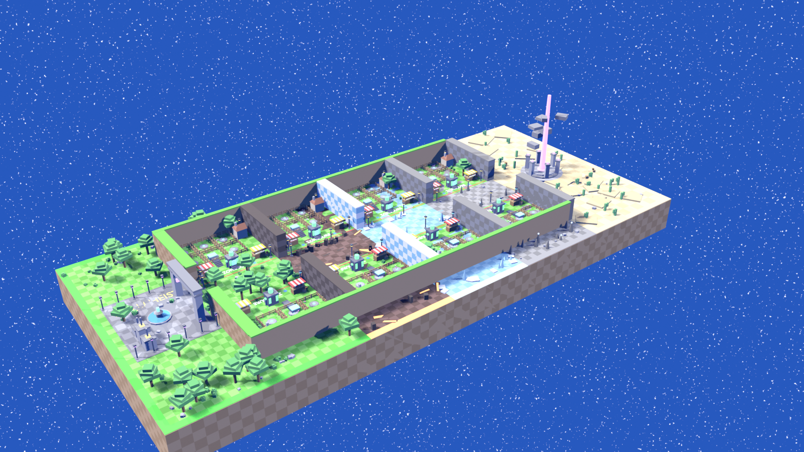
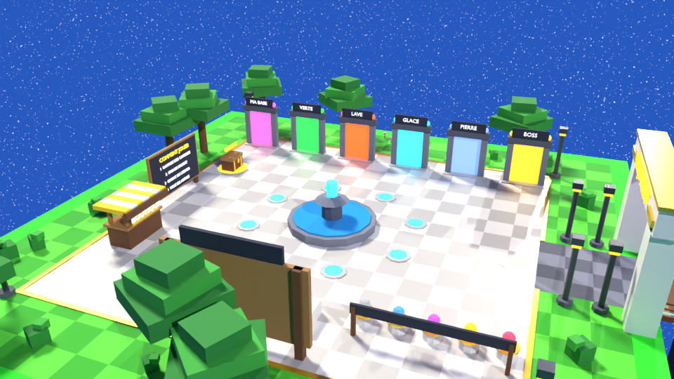
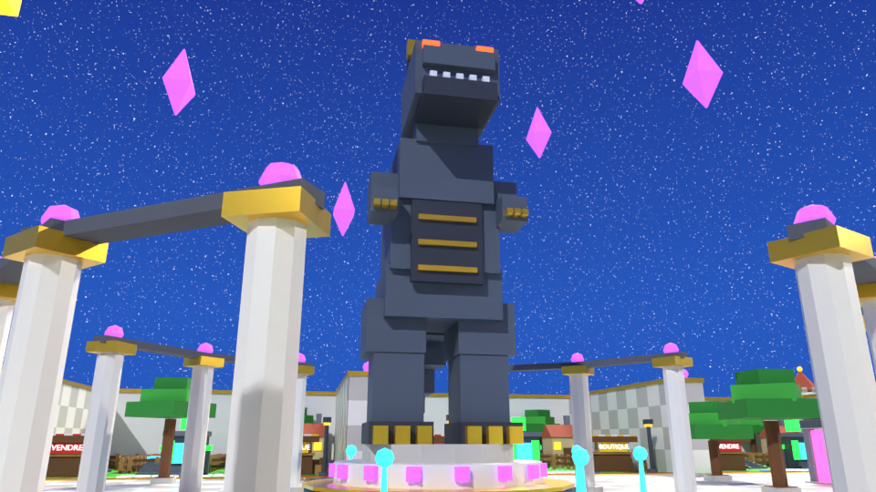
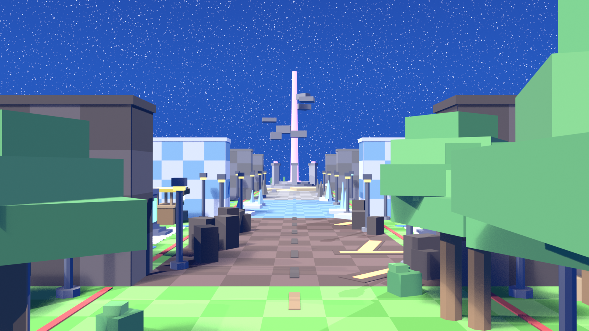
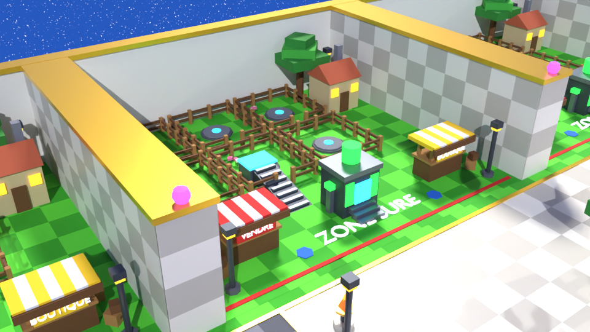
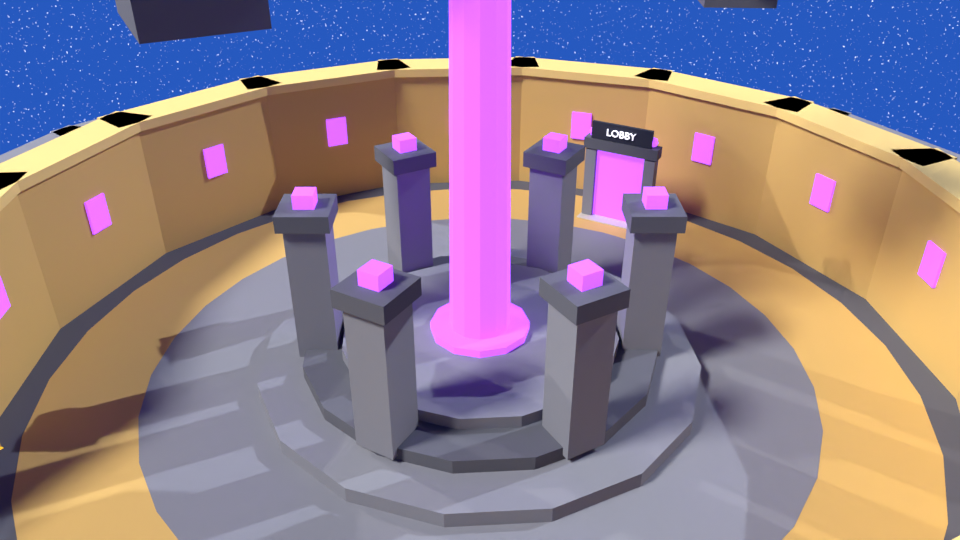

# 🗺️ MAPS — De Blender à une partie jouable dans Roblox

> Guide complet de la map de Kaiju Heist : ce qu'elle contient, comment la
> générer dans Blender, comment l'importer dans Roblox Studio, et ce qui la rend
> jouable une fois importée. `ZONES.md` détaille les 5 zones ; ce document-ci
> couvre toute la chaîne.

---

## 1. Ce que contient la map

La map suit le plan dessiné (`KaijuHeist/assets/map/plan_reference.png`) : un
**T** vu de dessus. La barre du T est le **lobby**, la tige est le **couloir des
zones**.

```
 +-----------+
 | B3 |      |
 | B1 |      +------------------------------------------------------+
 |    | LOBBY  Zone 1 | Zone 2 | Zone 3 | Zone 4 | Zone 5 ( arène )
 | B2 |      +------------------------------------------------------+
 | B4 |      |
 +-----------+
```



| Section | Taille (studs) | Contenu |
|---|---|---|
| **Lobby** | 440 × 660 | place de marbre traversée par deux avenues ; au centre, **statue géante d'un kaiju** (~100 studs) sur un piédestal à 3 étages dans un bassin à jets lumineux, entourée d'une colonnade et de cristaux flottants ; **8 points de spawn** autour du bassin ; galerie de **6 portails** (MA BASE, VERTE, LAVE, GLACE, PIERRE, BOSS) avec bannières ; vitrine de **5 œufs géants** (raretés) ; **CLASSEMENT** géant + podium 1-2-3 ; **CADEAU DU JOUR** ; panneau **COMMENT JOUER** ; 4 tours d'angle ; braseros, lampadaires, jardins |
| **Boutiques** | 34 × 18 chacune | à l'entrée du couloir comme sur le plan : **BOUTIQUE / VENTE** (côté nord, capsules en vitrine) et **VITESSE** (côté sud, bottes lumineuses) |
| **Porte monumentale** | 166 de large, 70 de haut | deux tours surmontées de têtes de kaiju, fronton « KAIJU HEIST », panneau « ZONE VERTE » |
| **Bases (« enclos »)** | 132 × 122 chacune | **4 bases** identiques B1…B4 alignées sur le côté ouest du lobby, séparées par des murs de marbre ; chacune : 6 enclos avec portillon et socle, maison, VENDRE, BOUTIQUE, machine à éclore, tapis roulant, ligne ZONE SÛRE |
| **Zones 1 à 4** | 160 × 112 chacune | couloir fermé par deux murs de 30 aux couleurs de la zone, portique avec le nom de la zone, lampadaires, décor de plus en plus dense, repères géants derrière les murs (arbre géant, volcans, château de glace, arche rocheuse) |
| **Zone 5 — Désert** | 260 | fin du couloir puis **arène circulaire du boss** (rayon 88) : mur en anneau, gradins, autel à piliers et rayon violet, portail retour LOBBY ; pyramides derrière les murs |

Les bases sont **strictement identiques** (même modèle instancié) : aucun
joueur n'a une meilleure base qu'un autre. Pour en avoir plus, change
`base_count` dans `CONFIG` : la colonne et le lobby s'allongent tout seuls.

| Lobby | Statue |
|---|---|
|  |  |

| Couloir (zone Verte → Lave → Glace…) |
|---|
|  |

| Une base | Arène du boss |
|---|---|
|  |  |

---

## 2. Générer la map dans Blender

Un seul script : `KaijuHeist/blender/build_map.py`. Deux façons de le lancer.

**En ligne de commande** (le plus fiable) :

```bash
"/c/Program Files/Blender Foundation/Blender 5.2/blender.exe" -b --python "KaijuHeist/blender/build_map.py"
```

**Depuis Blender** : onglet *Scripting* → *Ouvrir* → `build_map.py` → *Exécuter
le script*. Le script vide la scène lui-même (sans `read_factory_settings`) et
marche avec l'interface en français.

### Ce qui est produit

| Fichier | Rôle |
|---|---|
| `assets/map/kaiju_heist_map.glb` | **la map entière, à importer dans Roblox** |
| `assets/map/kaiju_heist_map.blend` | la même scène, pour la regarder dans Blender |
| `assets/map/sections/*.glb` | la même map découpée : `Lobby`, `Island` (dessous du couloir), `Zone1_Verte`… `Zone5_Desert`, `Plots` |
| `assets/map/preview_*.png` | 6 rendus : aerial, lobby, statue, street, plot, boss |
| `src/Shared/MapData.lua` | positions pour le gameplay (spawns, portails, zones, bases, couleurs) |
| `src/Server/MapColliders.lua` | les 501 volumes de collision invisibles |

Tous ces fichiers sont **générés** : ne les modifie jamais à la main, relance le
script.

### Ce que le script vérifie tout seul

À chaque exécution, il mesure sa propre sortie et affiche :

```
MESH_BUDGET total=86656 objects=217 unique_meshes=145 max=4148 (...)
COLLIDERS total=501 {'ground': 11, 'solid': 482, 'barrier': 8}
CHECKS passed=274 failed=0
```

Les 274 contrôles : zones contiguës, chaque spawn posé sur un sol et libre de
tout mur, chaque portail atteignable, chaque zone de capsules dans sa zone et
libre de tout obstacle, chaque base dans la bonne zone, chaque objet sous
10 000 triangles avec **une seule** matière et un nom au bon format. Une ligne
`CHECK_FAIL` dit exactement quoi et où.

### Réglages par variables d'environnement (optionnel)

| Variable | Effet |
|---|---|
| `KAIJU_SKIP_RENDER=1` | ne fait pas les rendus (génération en quelques secondes) |
| `KAIJU_RENDER_ENGINE=CYCLES` | rendus sur CPU, pour une machine sans GPU |
| `KAIJU_RENDER_PERCENT=50` | rendus à 50 % de la taille (1600 × 900 par défaut) |

---

## 3. Importer dans Roblox Studio

1. Lance la synchro du code comme d'habitude : `rojo serve` depuis `KaijuHeist/`,
   puis *Connect* dans le plugin Rojo.
2. Supprime l'ancienne map importée s'il y en a une.
3. Importe **`assets/map/kaiju_heist_map.glb`** avec le 3D Importer (onglet
   Avatar → Import 3D). Laisse le modèle dans `Workspace`, **peu importe où il
   atterrit** : `MapService` le recale tout seul (voir §4).
4. **Enregistre la place.** Rojo ne gère pas `Workspace` : la map vit dans le
   fichier de la place, pas dans le dépôt.
5. Paramètres du jeu → nombre de joueurs max = **4** (une base par joueur ;
   à ajuster si tu changes `base_count`).
6. *Play*. Dans la fenêtre Output, tu dois voir :

```
MapService: aligned Workspace.<nom du modèle> (moved ... studs, scale x1.000, residual 0.000)
MapService: 1 map model(s), 501 colliders, 8 spawns, 7 portals
```

Variante : importer les `sections/*.glb` une par une au lieu de la map entière
(utile pour itérer sur une seule zone). Chaque section embarque les repères
d'alignement et se recale indépendamment. N'importe pas les deux à la fois,
tu aurais la map en double.

---

## 4. Ce qui la rend jouable (le contrat Blender ↔ Roblox)

Un GLB importé tel quel n'est **pas** jouable : couleurs incertaines, collisions
approximatives sur les gros maillages, rien pour spawn ni se téléporter. Le
script Blender et `MapService` sont écrits l'un pour l'autre :

| Problème | Côté Blender | Côté Roblox (`src/Server/MapService.lua`) |
|---|---|---|
| Couleurs et matières | **1 matière par objet**, nom `<Nom>__<clé>` (ex. `Zone2_Lave__lava_glow`) | lit la clé, applique couleur + matière Roblox depuis `MapData.materials` (**Neon** pour tout ce qui brille) |
| Collisions | liste chaque mur, sol, prop solide → `MapColliders.lua` | crée 501 parts invisibles exactes ; les meshes deviennent de purs visuels (groupe de collision `MapVisual`) mais la caméra les évite toujours |
| Position à l'import | 3 repères `REF_Origin`, `REF_AxisX`, `REF_AxisY` enfouis sous l'île | mesure les repères, corrige échelle, rotation et position, puis rend les repères invisibles |
| Spawn | 8 pads autour de la fontaine → `MapData.lobby.spawns` | 8 `SpawnLocation` invisibles, orientées vers les portails |
| Portails | déclencheurs → `MapData.portals` | téléporte au contact : zone → début de la zone, MA BASE → sa base, LOBBY → un spawn du lobby |
| Baseplate du modèle Studio | — | supprimée (elle z-fighterait avec le sol à Y = 0) |

Autres services branchés sur la map :

- **`PlotService`** attribue une base à chaque joueur (dans l'ordre B1, B2, B3,
  B4 : les premières sont les plus proches de l'avenue centrale), affiche
  « Base de *Pseudo* » au-dessus de la machine, libère la base au départ.
  Attribut joueur `PlotId`.
- **`CapsuleService`** fait apparaître les capsules dans la voie de course de
  chaque zone (`MapData.zones[i].capsuleArea`), jamais dans un mur. Chaque
  capsule porte l'attribut `ZoneIndex` (1 → 5), prêt pour une rareté qui monte
  avec la zone.
- **`ZoneBanner`** (client) affiche le nom de la zone, dans sa couleur, quand le
  joueur y entre.

---

### Garder tes propres réglages de couleur dans Studio

Par défaut, `MapService` réapplique au lancement la couleur, la matière et la
transparence de la palette Blender : une pièce repeinte dans Studio reprendrait
sa couleur d'origine au Play. Pour garder ton réglage :

1. sélectionne la pièce (MeshPart) — ou un Model / Folder au-dessus d'elle pour
   en protéger tout un groupe ;
2. Properties → *Attributes* → **+** → nom `KeepStudioLook`, type **boolean**,
   coche-le.

`MapService` laisse alors Color, Material et Transparency tels que tu les as
réglés, et l'indique dans l'Output (`… keep their Studio look`). Les collisions,
l'ancrage et le recalage restent gérés comme avant.

⚠️ Réimporter le GLB crée de nouvelles pièces : les attributs posés sur
l'ancienne map sont perdus. Pour un changement de couleur définitif, modifie
plutôt `PALETTE` dans `build_map.py`.

## 5. Modifier la map

Tout se règle en haut de `build_map.py` :

| Tu veux… | Modifie |
|---|---|
| changer une taille (couloir, zones, bases, murs, place, statue) | `CONFIG` |
| changer le nombre de bases | `CONFIG["base_count"]` |
| changer une zone (sol, murs, couleur de lueur, quantité de décor) | son entrée dans `BIOMES` |
| changer une couleur ou une matière Roblox | `PALETTE` (clé `rbx` pour la matière Roblox) |
| ajouter un prop | une fonction `add_*` ; `solid=True` pour qu'il bloque les joueurs |

Puis : relance le script → supprime l'ancienne map dans Studio → réimporte le
GLB. `MapData.lua` et `MapColliders.lua` suivent automatiquement (Rojo les
synchronise).

Ajouter une zone = ajouter une entrée à `BIOMES` : le couloir s'allonge, le
lobby lui crée un portail (la galerie s'élargit).

---

## 6. Ce qui a été vérifié (26/09/2026)

Vérifié par mesure, sur Blender 5.0.1 (module `bpy`) :

- génération complète sans erreur, **274/274 contrôles** passés ;
- GLB réimporté dans une scène vide : 217 pièces, 145 meshes (les 4 bases
  partagent les leurs), **aucune** pièce multi-matière, 3,6 Mo ;
- les 3 repères tombent **exactement** sur les coordonnées de `MapData.reference` ;
  le portail MA BASE et les machines des bases B1 et B4 tombent sur leurs
  ancres `MapData` ;
- les 16 fichiers Luau compilent (compilateur Luau réel) ;
- `MapData.lua` et `MapColliders.lua` exécutés dans une VM Luau avec des tests :
  chaque nom du GLB trouve sa couleur, chaque spawn est dans la bonne zone,
  chaque portail a une destination, zones contiguës ; `PlotService` testé
  (4 bases attribuées dans l'ordre, 5e joueur sans base, libération et
  réattribution).

**Pas vérifié** : l'exécution dans Roblox Studio lui-même (pas de Studio dans
cet environnement). Le comportement exact du 3D Importer (noms des pièces,
matières créées, ancrage) est anticipé, pas mesuré : `MapService` est écrit
pour s'adapter (il avertit s'il trouve une pièce sans clé de matière). À la
première importation, vérifie les deux lignes Output du §3.

Les aperçus du dépôt ont été rendus avec Cycles (pas de GPU ici) ; chez toi le
script rend avec EEVEE.

---

## 7. Reste à faire

- **Vol physique** : `ProximityPrompt` sur `plot.house` au lieu de la liste
  d'UI (`MapData.plots[i].house` est prêt).
- Afficher les kaijus sur les socles des enclos (`MapData.plots[i].pens`).
- Brancher les deux boutiques : `MapData.lobby.shop` et `MapData.lobby.speedShop`
  (position + orientation du comptoir). La boutique VITESSE attend un achat de
  vitesse de déplacement côté serveur.
- Brancher un vrai classement sur `MapData.lobby.leaderboard` (position,
  taille, orientation de l'écran fournies).
- `StreamingEnabled` à activer dans Studio (propriété de `Workspace`).
